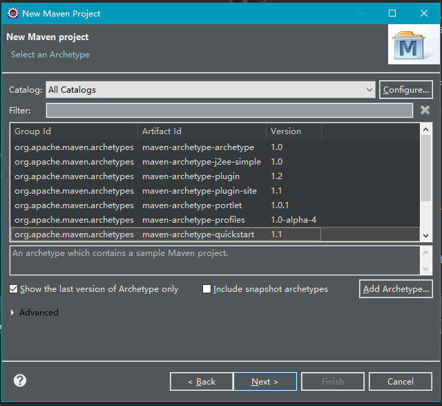
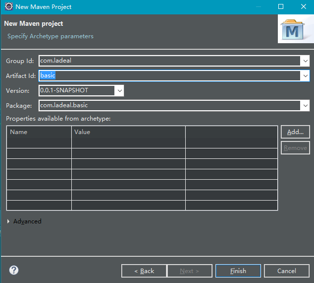
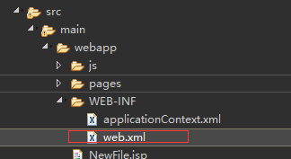
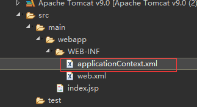
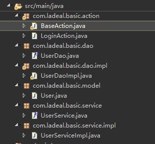
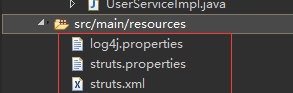

**一、新建MAVEN项目**

   选中maven-aechetype-webapp 

group Id一般为公司域 ；Artifact Id相当于项目名称 ·

**二、配置pom.xml**

<project xmlns="http://maven.apache.org/POM/4.0.0" xmlns:xsi="http://www.w3.org/2001/XMLSchema-instance" xsi:schemaLocation="http://maven.apache.org/POM/4.0.0 http://maven.apache.org/xsd/maven-4.0.0.xsd">
  <modelVersion>4.0.0</modelVersion>
  <groupId>com.ladeal</groupId>
  <artifactId>basic</artifactId>
  <version>0.0.1-SNAPSHOT</version>
  <packaging>war</packaging>
      <build>
        <plugins>
            <plugin>
                <groupId>org.apache.maven.plugins</groupId>
                <artifactId>maven-war-plugin</artifactId>
                <version>2.6</version>
                <configuration>
                	<source>1.8</source>
                	<target>1.8</target>
                    <failOnMissingWebXml>false</failOnMissingWebXml>
                </configuration>
            </plugin>
        </plugins>
    </build>
     <properties>
        <failOnMissingWebXml>false</failOnMissingWebXml>
    </properties>
    
​    

    <profiles>
    <profile>
    	<id>jdk-1.8</id>
    	<activation>
    		<activeByDefault>true</activeByDefault>
    		<jdk>1.8</jdk>
    	</activation>
    	<properties>
    		<maven.compiler.source>1.8</maven.compiler.source>
    		<maven.compiler.target>1.8</maven.compiler.target>
    		<maven.compiler.compilerVersion>1.8</maven.compiler.compilerVersion>
    	</properties>
    </profile>
</profiles>

<!--   网上配置 -->

 <dependencies>
    <dependency>
      <groupId>junit</groupId>
      <artifactId>junit</artifactId>
      <version>3.8.1</version>
      <scope>test</scope>
    </dependency>

	 <!-- 添加SSH依赖 -->    
	 <!-- Struts2 -->    
	 <dependency>    
	     <groupId>org.apache.struts</groupId>    
	     <artifactId>struts2-core</artifactId>    
	     <version>2.0.9</version>    
	 </dependency>    
	 
	 <dependency>    
	     <groupId>org.apache.struts</groupId>    
	     <artifactId>struts2-spring-plugin</artifactId>    
	     <version>2.0.9</version>    
	 </dependency>    
	 
	<!-- 添加Hibernate依赖 -->    
	<dependency>    
	    <groupId>org.hibernate</groupId>    
	    <artifactId>hibernate-core</artifactId>    
	    <version>3.6.5.Final</version>    
	</dependency>    
	
	<dependency>    
	    <groupId>commons-dbcp</groupId>    
	    <artifactId>commons-dbcp</artifactId>    
	    <version>1.4</version>    
	</dependency>    
	
	<dependency>  
	     <groupId>org.hibernate</groupId>  
	     <artifactId>hibernate</artifactId>  
	     <version>3.2.6.ga</version>  
	     <type>jar</type>  
	     <scope>compile</scope>  
	     <exclusions>  
	         <exclusion>  
	             <artifactId>jta</artifactId>  
	             <groupId>javax.transaction</groupId>  
	         </exclusion>  
	     </exclusions>  
	 </dependency>  
	 
	 <dependency>  
	     <groupId>org.hibernate</groupId>  
	     <artifactId>hibernate-annotations</artifactId>  
	     <version>3.2.0.ga</version>  
	     <type>jar</type>  
	     <scope>compile</scope>  
	 </dependency>  

​	 
	<!--添加mysql依赖 -->
	<dependency>  
	   <groupId>mysql</groupId>  
	   <artifactId>mysql-connector-java</artifactId>  
	   <version>5.1.6</version>  
	</dependency> 
	 
	<!-- 添加Log4J依赖 -->    
	<dependency>    
	    <groupId>log4j</groupId>    
	    <artifactId>log4j</artifactId>    
	    <version>1.2.16</version>    
	</dependency>    
	
	<dependency>    
	  <groupId>org.slf4j</groupId>    
	  <artifactId>slf4j-api</artifactId>    
	  <version>1.6.1</version>    
	</dependency>    
	
	<dependency>    
	    <groupId>org.slf4j</groupId>    
	    <artifactId>slf4j-nop</artifactId>    
	    <version>1.6.4</version>    
	</dependency>   
	
	 <!-- 添加javassist -->    
<!--     <dependency>     -->
<!--         <groupId>javassist</groupId>     -->
<!--         <artifactId>javassist</artifactId>     -->
<!--         <version>3.11.0.GA</version>     -->
<!--     </dependency>     -->
        
    <!-- 添加Spring依赖 -->    
    <dependency>    
        <groupId>org.springframework</groupId>    
        <artifactId>spring-core</artifactId>    
        <version>3.1.1.RELEASE</version>    
    </dependency>    
        
    <dependency>    
        <groupId>org.springframework</groupId>    
        <artifactId>spring-beans</artifactId>    
        <version>3.1.1.RELEASE</version>    
    </dependency>    
        
    <dependency>    
        <groupId>org.springframework</groupId>    
        <artifactId>spring-context</artifactId>    
        <version>3.1.1.RELEASE</version>    
    </dependency>    
        
    <dependency>    
        <groupId>org.springframework</groupId>    
        <artifactId>spring-jdbc</artifactId>    
        <version>3.1.1.RELEASE</version>    
    </dependency>    
        
    <dependency>    
        <groupId>org.springframework</groupId>    
        <artifactId>spring-orm</artifactId>    
        <version>3.1.1.RELEASE</version>    
    </dependency>    
        
    <dependency>    
        <groupId>org.springframework</groupId>    
        <artifactId>spring-web</artifactId>    
        <version>3.1.1.RELEASE</version>    
    </dependency>     

  </dependencies>
</project>

   三、**编写配置文件** 

**web.xml**

<!DOCTYPE web-app PUBLIC
 "-//Sun Microsystems, Inc.//DTD Web Application 2.3//EN"
 "http://java.sun.com/dtd/web-app_2_3.dtd" >

<web-app>
  <display-name>Archetype Created Web Application</display-name>

  <!-- 配置sturts2过滤器 -->
  <filter>  
      <filter-name>struts2</filter-name>  
      <filter-class>org.apache.struts2.dispatcher.FilterDispatcher</filter-class>  
  </filter>  
  <filter-mapping>  
      <filter-name>struts2</filter-name>  
      <url-pattern>/*</url-pattern>  
  </filter-mapping>  

  <!-- Spring 监听器 -->  
  <listener>  
      <listener-class>org.springframework.web.context.ContextLoaderListener</listener-class>  
  </listener> 

  <session-config>
      <session-timeout>10</session-timeout>   <!-- 10分钟登录过期 -->
  </session-config>
  <welcome-file-list>
      <welcome-file>index.jsp</welcome-file>  <!-- 欢迎界面 -->
  </welcome-file-list>

</web-app>    

在web-inf下面添加applicationContext.xml文件:

**applicationContext.xml**

<?xml version="1.0" encoding="UTF-8"?>

<beans xmlns="http://www.springframework.org/schema/beans"
    xmlns:xsi="http://www.w3.org/2001/XMLSchema-instance"
    xmlns:aop="http://www.springframework.org/schema/aop"
    xmlns:tx="http://www.springframework.org/schema/tx"
    xsi:schemaLocation="http://www.springframework.org/schema/beans http://www.springframework.org/schema/beans/spring-beans-3.0.xsd
                http://www.springframework.org/schema/aop http://www.springframework.org/schema/aop/spring-aop-2.5.xsd
                http://www.springframework.org/schema/tx http://www.springframework.org/schema/tx/spring-tx-3.0.xsd" default-autowire="byName">
        
        <bean id="loginAction" class="com.ladeal.basic.action.LoginAction">
       		 <property name="userService" ref="userService"></property>
        </bean>  
        <bean id="userService" class="com.ladeal.basic.service.impl.UserServiceImpl">
        	<property name="userDao" ref="userDao"></property>
        </bean>  
        	<bean id="userDao" class="com.ladeal.basic.dao.impl.UserDaoImpl">
    	<property name="sessionFactory" ref="sessionFactory"></property>
    </bean>
        <bean id="dataSource" class="org.apache.commons.dbcp.BasicDataSource">  
            <property name="driverClassName" value="com.mysql.jdbc.Driver"></property>  
            <property name="url" value="jdbc:mysql://localhost:3306/zq?useUnicode=true&amp;characterEncoding=UTF-8"></property>  
            <property name="username" value="root"></property>  
            <property name="password" value="woailiushasha"></property>  
    	</bean>    
    	
    	<bean id="sessionFactory" class="org.springframework.orm.hibernate3.annotation.AnnotationSessionFactoryBean">  
            <property name="dataSource">  
                <ref bean="dataSource" />  
            </property>  
            <property name="annotatedClasses">  
                <list>  
                    <value>com.ladeal.basic.model.User</value>  
                </list>  
            </property>  
            <property name="hibernateProperties">  
                <props>  
                    <prop key="hibernate.dialect">org.hibernate.dialect.MySQL5Dialect</prop>  
                    <prop key="hibernate.show_sql">true</prop>  
                    <prop key="hibernate.hbm2ddl.auto">create</prop>  
                </props>  
            </property>  
        </bean>    
    <!-- 配置事务管理器 -->
    <bean id="transactionManager"
    	class="org.springframework.orm.hibernate3.HibernateTransactionManager">
    	<property name="sessionFactory" ref="sessionFactory" />
    </bean>
    
    <!-- 开启注解事务 -->
    <tx:annotation-driven transaction-manager="transactionManager" />  
</beans>

四、新建一套model、action、dao、daoImpl、service、serviceImpl

在resources下面建3个配置文件。

**log4j.properties**

log4j.rootLogger=debug,stdout
log4j.appender.LogFile=org.apache.log4j.DailyRollingFileAppender

log4j.appender.LogDB=com.sipu.utils.ApplicationLogDBAppender
log4j.appender.LogDB.layout=org.apache.log4j.PatternLayout
log4j.appender.LogDB.sql=INSERT INTO applicationLog  VALUES ('%d{yyyy-MM-dd HH:mm:ss}', '%t', '%p', '%l', '%m', '')

log4j.appender.LogFile.file=D\:/UserTagMng_logs/UserTagMng.log   
log4j.appender.LogFile.DatePattern='.'yyyy-MM-dd   
log4j.appender.LogFile.layout=org.apache.log4j.PatternLayout   
log4j.appender.LogFile.layout.ConversionPattern=%d{ABSOLUTE} %5p  %c{1}:%L - %m%n

log4j.appender.stdout=org.apache.log4j.ConsoleAppender
log4j.appender.stdout.Target=System.out
log4j.appender.stdout.layout=org.apache.log4j.PatternLayout
log4j.appender.stdout.layout.ConversionPattern=%d{ABSOLUTE} %5p  %c{1}:%L - %m%n

**struts.propertires**

#修改配置后自动加载
struts.configuration.xml.reload=true

#开发者模式
struts.devMode=true

#设置编码方式为utf-8
struts.i18n.encoding=UTF-8

#自定义扩展名
struts.action.extension=action,,

**struts.xml**

<?xml version="1.0" encoding="UTF-8" ?> 
<!DOCTYPE struts PUBLIC
    "-//Apache Software Foundation//DTD Struts Configuration 2.1.7//EN"
    "http://struts.apache.org/dtds/struts-2.1.7.dtd">
<struts>
 	<package name="default" extends="struts-default">
		<action name="login" class="com.ladeal.basic.action.LoginAction" method="login">
			<result name="success">/pages/success.jsp</result>
			<result name="failured">/pages/index.jsp</result>
		</action>
		<action name="user_test" class="com.ladeal.basic.action.LoginAction" method="test">
				<result name="success">/pages/success.jsp</result>
		</action>
	</package>
</struts>